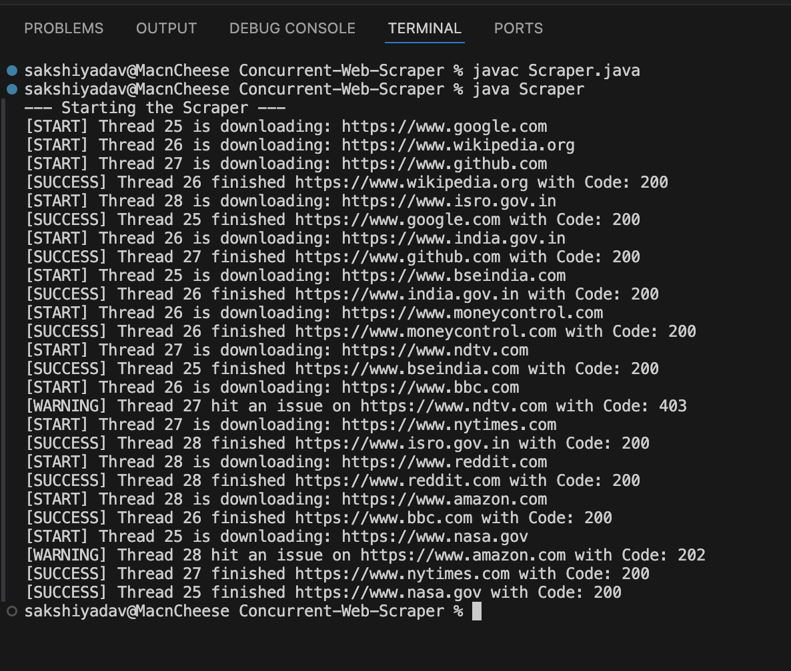

#  Concurrent Web Scraper & Downloader

A high-performance, resilient web crawler engine built from scratch in Java. This project simulates the core distribution architecture of a real-world search engine scraper or data aggregation platform, capable of handling concurrent network streams, rate-limiting, and network failures smoothly.

---

##  The Real-World Problem It Solves
Network Input/Output (I/O) operations are inherently slow. When downloading a webpage, a single-threaded CPU spends roughly **99% of its runtime idle**, waiting for remote servers to respond. 

While spinning up parallel threads solves the speed issue, aggressive scraping can overwhelm target servers, leading to **IP bans, HTTP 429 (Too Many Requests) errors, or corrupted data**. This engine balances speed and courtesy.

##  Key Architectural Solutions
* **Non-Blocking Multithreading:** Utilizes a thread-isolated `ExecutorService` pool to keep worker threads actively processing while others are blocked waiting on network responses.
* **Thread-Safe Data Distribution:** Uses a `ConcurrentLinkedQueue` to stream URLs dynamically without data races or resource-locking over-overhead.
* **Domain-Specific Rate Limiting:** Implements a strict `Semaphore` synchronization manager to enforce maximum concurrent request boundaries.
* **Fault-Tolerant Network Logic:** Hardened with manual `User-Agent` emulation (to prevent automated client rejection) along with strict connection/read timeouts to prevent dead connection hanging.

---

##  Execution & Results

Below is a live snapshot of the concurrent worker threads processing global and regional (Indian) domains concurrently:



---

## 📂 Project Structure
```text
Concurrent-Web-Scraper/
│
├── Scraper.java       # Main application source code
└── README.md          # Project documentation